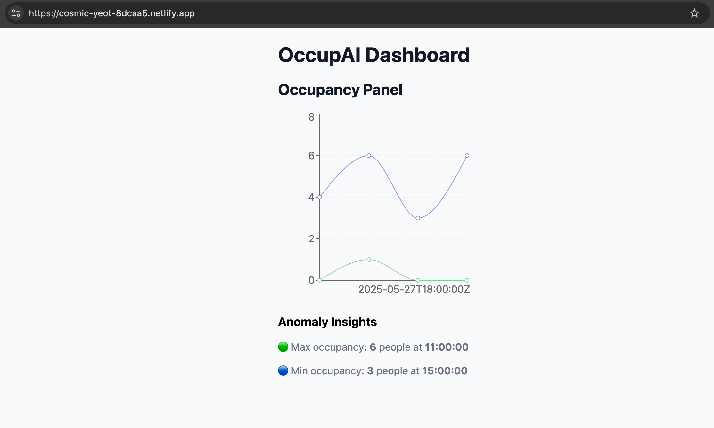

# 🧠 OccupAI: Real-Time Room Occupancy Dashboard

**Live Demo:**  
🌐 https://cosmic-yeot-8dcaa5.netlify.app

---




## 📍 Overview

**OccupAI** is a real-time dashboard application built with **React** that visualizes live occupancy data (number of people and groups in a room) using **InfluxDB** as the time-series backend.

This app features:

- 📈 A dynamic chart showing `people_count` and `group_count` over time
- 📊 An anomaly widget showing the highest and lowest recorded occupancy
- 🔌 Integration with InfluxDB using Flux queries
- 🌐 Live deployment via Netlify

---

## 🧰 Tech Stack

- **React** – Frontend framework
- **Recharts** – Charting library for rendering time series data
- **InfluxDB** – Time-series database for storing occupancy metrics
- **Flux** – InfluxDB query language
- **Netlify** – Hosting platform for the frontend

---

## 🚀 Live Site

You can view the live deployed version here:  
👉 **[https://cosmic-yeot-8dcaa5.netlify.app](https://cosmic-yeot-8dcaa5.netlify.app)**

---

## 📂 Project Structure

client/
├── public/
├── src/
│ ├── components/
│ │ ├── PanelChart.jsx # Line chart for people_count & group_count
│ │ ├── AnomalyWidget.jsx # Max/min occupancy insights
│ │ └── Dashboard.jsx # Layout that combines chart + widget
│ ├── utils/
│ │ └── fetchInfluxData.js # InfluxDB query logic (Flux)
│ └── App.js
├── package.json


---

## 🛠️ Getting Started Locally

### 1. Clone the repo

```bash
git clone https://github.com/your-username/occupai-dashboard.git
cd occupai-dashboard/client
```

### 2. Install dependencies

```bash
npm install
```
### 3. Configure InfluxDB (if querying directly)

If you're connecting directly to InfluxDB (not recommended for production), make sure your fetchInfluxData.js file contains your:

URL

Token

Organization

Bucket

Do not expose real credentials in production.

### 4. Run the development server

```bash
npm start
```

Your app will be running at http://localhost:3000

## 🏗️ Deploying to Netlify

### 1. Build the project

From the root of your React project, run:

```bash
npm run build
```

### 2. Deploy using Netlify

#### Option A: Manual (Drag & Drop)

1. Go to [https://app.netlify.com](https://app.netlify.com)
2. Log in or create a free account
3. Click **"Add new site"** → **"Deploy manually"**
4. Drag and drop the entire `build/` folder (created in step 1) into the upload area
5. Netlify will automatically upload and deploy your site
6. You'll get a live URL like: `https://your-site-name.netlify.app`

---

#### Option B: GitHub Integration (Automatic Deploys)

1. Push your project to a GitHub repository
2. In Netlify, click **"Add new site"** → **"Import from Git"**
3. Connect your GitHub account and select your repository
4. Set the build settings:
   - **Build command**: `npm run build`
   - **Publish directory**: `build`
5. Click **"Deploy Site"**

Netlify will now build and deploy your app. Every time you push to the `main` branch, it will redeploy automatically.

---


